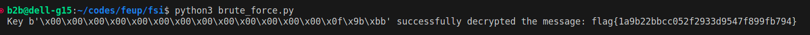

# Week Script #10 (Secret Key Encryption)

## Task 1 - Frequency Analysis

In the first task, a file named `ciphertext.txt` was provided, containing encrypted content using a `monoalphabetic cipher`. Utilizing a technique known as `Frequency analysis`, the list of most frequently used letters was determined:

```txt
1-gram (top 20):
n: 488
y: 373
v: 348
x: 291
u: 280
q: 276
m: 264
h: 235
t: 183
i: 166
p: 156
a: 116
c: 104
z: 95
l: 90
g: 83
b: 83
r: 82
e: 76
d: 59
-------------------------------------
2-gram (top 20):
yt: 115
tn: 89
mu: 74
nh: 58
vh: 57
hn: 57
vu: 56
nq: 53
xu: 52
up: 46
xh: 45
yn: 44
np: 44
vy: 44
nu: 42
qy: 39
vq: 33
vi: 32
gn: 32
av: 31
-------------------------------------
3-gram (top 20):
ytn: 78
vup: 30
mur: 20
ynh: 18
xzy: 16
mxu: 14
gnq: 14
ytv: 13
nqy: 13
vii: 13
bxh: 13
lvq: 12
nuy: 12
vyn: 12
uvy: 11
lmu: 11
nvh: 11
cmu: 11
tmq: 10
vhp: 10
```

Combining this letter frequency with bigrams and trigrams, it was possible, using knowledge of common English bigrams:

```txt
th 3.56%       of 1.17%       io 0.83%
he 3.07%       ed 1.17%       le 0.83%
in 2.43%       is 1.13%       ve 0.83%
er 2.05%       it 1.12%       co 0.79%
an 1.99%       al 1.09%       me 0.79%
re 1.85%       ar 1.07%       de 0.76%
on 1.76%       st 1.05%       hi 0.76%
at 1.49%       to 1.05%       ri 0.73%
en 1.45%       nt 1.04%       ro 0.73%
nd 1.35%       ng 0.95%       ic 0.70%
ti 1.34%       se 0.93%       ne 0.69%
es 1.34%       ha 0.93%       ea 0.69%
or 1.28%       as 0.87%       ra 0.69%
te 1.20%       ou 0.87%       ce 0.65%
```

This led to the following correlation:

```txt
y -> t
t -> h
n -> e
v -> a
x -> o
u -> n
p -> d
m -> i
r -> g
b -> f
h -> r
q -> s
i -> l
l -> w
s -> k
d -> y
e -> p
a -> c
z -> u
g -> b
c -> m
f -> v
w -> z
j -> q
k -> x
```

Thus, the file was decrypted with the command `tr 'ytnvxupmrbhqilsdeazgcfwjk' 'theaondigfrslwkypcubmvzqx' < ciphertext.txt > out.txt`, resulting in the following text:

```txt
(the decrypted text)
```

### Task 2 - Encryption using Different Ciphers and Modes

This task required encrypting the file with three different cipher techniques. The chosen ones were:

```sh
openssl enc -aes-128-cbc -e  -in out.txt -out cipher.bin \-K  00112233445566778889aabbccddeeff \-iv 0102030405060708
openssl enc -bf-cbc -e  -in out.txt -out cipher1.bin \-K  00112233445566778889aabbccddeeff \-iv 0102030405060708
openssl enc -aes-128-cfb -e  -in out.txt -out cipher2.bin \-K  00112233445566778889aabbccddeeff \-iv 0102030405060708
```

Thus, `out.txt` was encrypted with three different encryptors.

### Task 3 - Encryption Mode – ECB vs. CBC

In this task, an image `pic_original.bmp` representing an image was provided. The task was to encrypt the image:

```sh
openssl enc -aes-128-ecb -e  -in pic_original.bmp -out img.bmp \-K  00112233445566778889aabbccddeeff \-iv 0102030405060708
```

Subsequently, the following commands were executed:

```sh
head -c 54 pic_original.bmp  > header
tail -c +55 img.bmp > body
cat header body > new.bmp
```

The resulting image was:


*Fig 1. Image*


## CTF #10 (Weak Encryption)

### Analysis of Code

The provided Python code segment implements a simple encryption scheme using the AES-CTR cipher. However, there is a weakness in the key generation process, allowing for a brute-force attack due to a hotfix applied to the offset value.

```python
def gen(): 
	offset = 3 # Hotfix to make Crypto blazing fast!!
	key = bytearray(b'\x00'*(KEYLEN-offset)) 
	key.extend(os.urandom(offset))
	return bytes(key)

def enc(k, m, nonce):
	cipher = Cipher(algorithms.AES(k), modes.CTR(nonce))
	encryptor = cipher.encryptor()
	cph = b""
	cph += encryptor.update(m)
	cph += encryptor.finalize()
	return cph
```

This weakness is exploited by generating all possible keys (2^24 possibilities since only 3 bytes are combined) and attempting to decrypt the message for each key.

### Brute Force Code

```python
from cryptography.hazmat.primitives.ciphers import Cipher, algorithms, modes
import binascii
import os
import itertools

KEYLEN = 16

def dec(k, c, nonce):
    cipher = Cipher(algorithms.AES(k), modes.CTR(nonce))
    decryptor = cipher.decryptor()
    msg = b""
    msg += decryptor.update(c)
    msg += decryptor.finalize()
    return msg

def gen_key():
    offset = 3
    key = bytearray(b'\x00' * (KEYLEN - offset))
    key.extend(os.urandom(offset))
    return bytes(key)

def generate_combinations():
    last_bytes_length = 3
    return itertools.product(range(256), repeat=last_bytes_length)

ciphertextHex = 'ebf577a132750b83ea542bac69f5a8b36374b014de9e36c8703303513e408fa30a461d703b2a37'
nonceHex = '986227e0d4f64515cbb45440127a0cc2'

ciphertext = binascii.unhexlify(ciphertextHex)
nonce = binascii.unhexlify(nonceHex)

fixed_part = gen_key()[:-3]

for combination in generate_combinations():
    last_bytes = bytes(combination)
    key = fixed_part + last_bytes
    try:
        decrypted_message = dec(key, ciphertext, nonce)
        print(f"Key {key} successfully decrypted the message: {decrypted_message.decode()}")
    except Exception as e:
        pass
```

To streamline the brute-force code, a `generate_combinations()` method was introduced. This method efficiently combines the last 3 bytes of keys. Additionally, a try-catch block is used to handle potential decoding exceptions.

To discover the flag, execute the code and wait for successful decryption.


*Fig 2. Flag successfully found!*