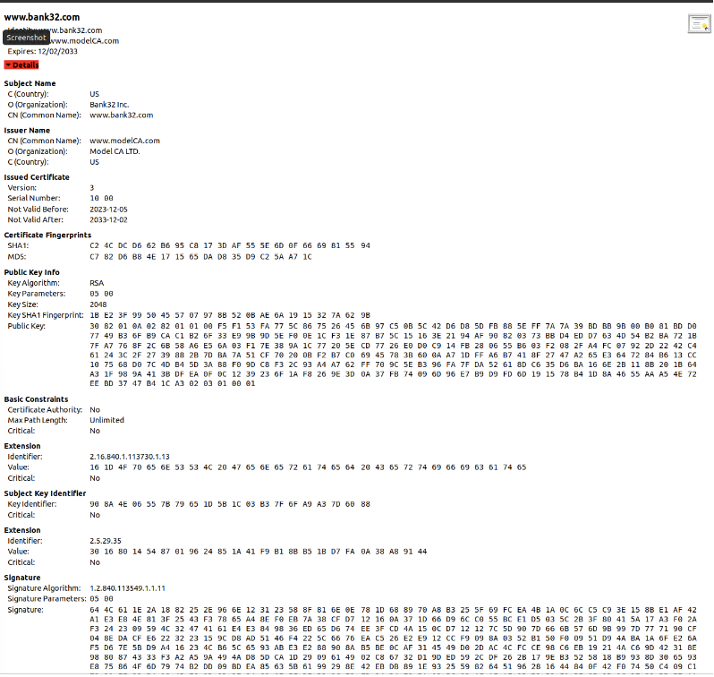

# LOGBOOK 11

# 2 Lab Environment

Download do arquivo Labsetup.zip
Descompactar e entrar na pasta
Configuração do Ambiente usando Docker Compose

```
$ dcbuild   # Alias: docker-compose build
$ dcup      # Alias: docker-compose up
```

- Executing Commands in Containers

```
$ dockps            # Alias para: docker ps --format "{{.ID}} {{.Names}}"
$ docksh <id>       # Alias para: docker exec -it <id> /bin/bash
```

## Configuração do DNS

- Open file /etc/hosts

```
sudo nano /etc/hosts

```

- Add the provided entries

```
10.9.0.80 www.bank32.com
10.9.0.80 www.smith2020.com

```

# 3 Lab Tasks 

## 3.1 Task 1: Becoming a Certificate Authority (CA)

Task 3.1 is to configure your own Certificate Authority (CA) and generate a self-signed certificate for that CA.

- Openssl.cnf Configuration File Configuration

```sh
cp /usr/lib/ssl/openssl.cnf ./openssl.cnf
nano openssl.cnf
```

- Uncomment the unique_subject = no line to allow creating certificates with the same subject

- Creating Required Directories and Files

```sh
mkdir demoCA
cd demoCA
mkdir certs crl newcerts
touch index.txt
echo "1000" > serial
```

- Generating the Self-Signed Certificate for the CA

```bash
openssl req -x509 -newkey rsa:4096 -sha256 -days 3650 \
-keyout ca.key -out ca.crt \
-subj "/CN=www.modelCA.com/O=Model CA LTD./C=US" \
-passout pass:dees
```


- Viewing Certificate and Private Key Details

```sh
openssl x509 -in ca.crt -text -noout
openssl rsa -in ca.key -text -noout
```


## 3.2 Task 2: Generating a Certificate Request for Your Web Server

- Certificate Request Generation (CSR)

```sh
openssl req -newkey rsa:2048 -sha256 \
-keyout server.key -out server.csr \
-subj "/CN=www.bank32.com/O=Bank32 Inc./C=US" \
-passout pass:dees
```

- Viewing CSR and Private Key Details

```sh
openssl req -in server.csr -text -noout
openssl rsa -in server.key -text -noout
```


- Adding Alternative Names (SAN) to the CSR

```sh
openssl req -newkey rsa:2048 -sha256 \
-keyout server.key -out server.csr \
-subj "/CN=www.bank32.com/O=Bank32 Inc./C=US" \
-addext "subjectAltName = DNS:www.bank32.com, DNS:www.bank32A.com, DNS:www.bank32B.com" \
-passout pass:dees
```

You now have a CSR generated with a public/private key pair and associated aliases. This CSR will be sent to the Certificate Authority (CA) for signature and generation of the corresponding certificate. These steps are important to ensure that your certificate is valid for the different hostnames associated with your server.

## 3.3 Task 3: Generating a Certificate for your server

- CSR Signature to Generate the Certificate

```sh
openssl ca -config myCA_openssl.cnf -policy policy_anything \
-md sha256 -days 3650 \
-in server.csr -out server.crt -batch \
-cert ca.crt -keyfile ca.key
```

- Enabling Extension Copy

Open the myCA_openssl.cnf file in a text editor and uncomment the copy_extensions = copy line. This allows the openssl ca command to copy the request extension to the final certificate.

- Checking Certificate Details

```sh
openssl x509 -in server.crt -text -noout
```



## 3.4 Task 4: Deploying Certificate in an Apache-Based HTTPS Website

- Access Containe

```
docker exec -it www-10.9.0.80 bash
```

- Edit the VirtualHost File

```sh
nano /etc/apache2/sites-available/bank32_apache_ssl.conf
```


- Enable the SSL Module and Website

```sh
a2enmod ssl
a2ensite bank32_apache_ssl
```

- Start the Apache Server

```sh
service apache2 start
```

- Open your web browser and navigate to your website using https://bank32.com


- Navigate to the "Authorities" tab, click "View Certificates," and import your certificate. Choose the option "Trust this CA to identify web sites."


After completing these steps, you should have a working HTTPS website.


## 3.5 Task 5: Launching a Man-In-The-Middle Attack

Task 5 aims to simulate a Man-In-The-Middle (MITM) attack and show how the PKI (Public Key Infrastructure) infrastructure can protect against this type of attack.


## Step 1: Configure the Malicious Website

We keep the SSLCertificateFile and SSLCertificateKeyFile settings the same as they were used in Task 4.


## Step 2: Modify the /etc/hosts file

- Open the /etc/hosts file on the victim system

```sh
sudo nano /etc/hosts
```

- Add an entry that maps the target site's hostname to the IP of your malicious server

```
10.9.0.80 www.example.com
```

## Step 3: Restart Apache

- Restart the Apache server to apply changes

```sh
service apache2 restart
```

## Step 4: Navigate to the Target Website

- On the victim machine's browser, access the target website (e.g. www.example.com)


We verified that the browser alerts you to a potential risk. This is due to the inconsistency of the certificate used, because the domain name does not match the one present in the server certificate.

## 3.6 Task 6: Launching a Man-In-The-Middle Attack with a Compromised CA

In this Task 6, the scenario involves assuming that the root Certificate Authority (CA) created in Task 1 has been compromised by an attacker, and the CA's private key has been stolen. This means that the attacker can generate arbitrary certificates using the compromised CA's private key.

- Generate a Malicious Certificate using the compromised private key

```sh
openssl req -newkey rsa:2048 -sha256 -keyout example.key -out example.csr -subj "/CN=www.example.com/O=example Inc./C=US" -passout pass:1234
openssl ca -config openssl.cnf -policy policy_anything -md sha256 -days 3650 -in example.csr -out example.crt -batch -cert ca.crt -keyfile ca.key

```
***

# CTF Week #11 - (RSA) Challenge Walkthrough

## Introduction

In this challenge, you are presented with an encrypted message (flag) using RSA encryption. The task is to decrypt this message and find the flag. RSA, a secure system when properly implemented, relies heavily on the difficulty of factoring large prime numbers. However, this challenge has a twist: the primes used are not entirely random and are close to specific values, making the task of cracking the cipher more feasible.

## Objective

Decrypt the RSA-encrypted flag, which is formatted as `flag{xxxxxxxx}`.

## Provided Information

1. **Encrypted Flag:** A ciphertext encrypted with RSA.
2. **Public Key Parameters:** The public exponent (`e`) and the modulus (`n`).
3. **Additional Clues:**
   - Prime `p` is close to `2^512`.
   - Prime `q` is close to `2^513`.

## Challenge File

A Python file, `challenge.py`, is provided, illustrating the method of converting the flag from bytes to a numeric value for encryption and vice versa for decryption.

## Solution Steps

### Step 1: Factorize the Modulus (n)

Given that the primes `p` and `q` are not completely random and are close to `2^512` and `2^513` respectively, the first step is to factorize `n` to find these primes. This can be done by:

1. Generating a list of probable prime candidates around `2^512` and `2^513`.
2. Testing pairs of these candidates to see if their product equals the given `n`.

THis code below was done in order to test it: 

```python
from sympy import isprime
from sympy import mod_inverse
import random

def find_near_prime(base, offset_range):
    """Encontra um número primo próximo ao valor base dentro de um intervalo de offset."""
    while True:
        candidate = base + random.randint(-offset_range, offset_range)
        if isprime(candidate):
            return candidate

# Definindo as bases para p e q
base_p = 2**512
base_q = 2**513

# Definindo um intervalo de variação razoável para busca de primos próximos às bases
offset_range = 10000  # Este valor pode ser ajustado conforme necessário

# Encontrando primos próximos a 2^512 e 2^513
p = find_near_prime(base_p, offset_range)
q = find_near_prime(base_q, offset_range)

print(f'p é = {p}')
print(f'q é = {q}')

# Já temos os primos p e q
# Calculando o módulo n e a função totiente de Euler (phi)
n = p * q
phi = (p - 1) * (q - 1)

# Escolhendo um expoente público e (geralmente 65537)
e = 65537

# Calculando o expoente privado d
d = mod_inverse(e, phi)
```

### Step 2: Calculate RSA Parameters

Once `p` and `q` are identified, calculate:

1. **Euler's Totient Function (ϕ):** `ϕ(n) = (p - 1) * (q - 1)`
2. **Private Exponent (d):** The modular inverse of `e` modulo `ϕ(n)`. This is a crucial step as `d` is the private key component in RSA.

### Step 3: Decrypt the Flag

With all parameters in hand, decrypt the flag using the formula:

\[ \text{Decrypted Message (m)} = \text{Ciphertext (c)}^d \mod n \]

Convert the ciphertext from hexadecimal to an integer, apply the decryption formula, and then convert the result back to a readable string format.

This code was used during coversion:

```python
from sympy import isprime
from sympy import mod_inverse
import random

def find_near_prime(base, offset_range):
    while True:
        candidate = base + random.randint(-offset_range, offset_range)
        if isprime(candidate):
            return candidate

def test_candidates(n, base_p, base_q, offset_range):
    for i in range(-offset_range, offset_range):
        p_candidate = base_p + i
        if isprime(p_candidate):
            q_candidate = n // p_candidate
            if n % p_candidate == 0 and isprime(q_candidate):
                return p_candidate, q_candidate
    return None, None

# Valores fornecidos
n = 359538626972463181545861038157804946723595395788461314546860162315465351611001926265416954644815072042240227759742786715317579537628833244985694861278986206259785454342119864617374359952879082323544262969822346940123477678654063974439152327219764977930491501559698538489861469119200053349189066319584673036413
e = 65537

# Definindo as bases e o intervalo de variação
base_p = 2**512
base_q = 2**513
offset_range = 10000  # Ajuste conforme necessário

# Encontrando os valores de p e q
p, q = test_candidates(n, base_p, base_q, offset_range)

if p and q:
    print(f'Encontrados p e q: p = {p}, q = {q}')
    phi = (p - 1) * (q - 1)
    d = mod_inverse(e, phi)
    print(f'Valor de d: {d}')
else:
    print('Não foi possível encontrar p e q com o intervalo fornecido.')
```

## Conclusion

Following these steps should lead you to successfully decrypt the flag. For this challenge, the decrypted flag is `flag{c9eba514e9865bf5573f5deb54143d0d}`. This exercise demonstrates the importance of secure prime generation in RSA encryption and provides practical experience in cryptographic problem-solving.


*Flag successfully found!*


