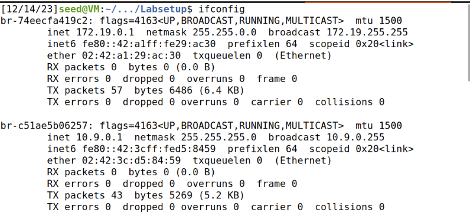
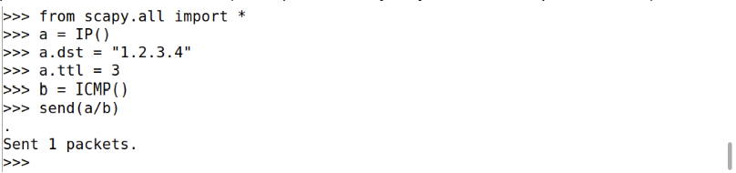

# LOGBOOK 13

## 2.1 Container Setup and Commands

Download the Labsetup.zip file to your VM from the lab’s website, unzip it, enter the Labsetup folder, and use the docker-compose.yml file to set up the lab environment.


All the containers will be running in the background. To run commands on a container, we often need to get a shell on that container. We first need to use the "docker ps" command to find out the ID of the container, and then use "docker exec" to start a shell on that container. We have created aliases for them in the .bashrc file.


## 2.2 About the Attacker Container




## 3.1 Task 1.1: Sniffing Packets

To use Scapy to do packet sniffing in Python programs. A sample code is provided in the following:


## 3.2 Task 1.2: Spoofing ICMP Packets

To spoof IP packets with an arbitrary source IP address. We will spoof ICMP echo request packets, and send them to another VM on the same network. We will use Wireshark to observe whether our request will be accepted by the receiver. If it is accepted, an echo reply packet will be sent to the spoofed IP address.


## 3.3 Task 1.3: Traceroute

To use Scapy to estimate the distance, in terms of number of routers, between your VM and a selected destination. This is basically what is implemented by the traceroute tool. In this task, we will write our own tool. The idea is quite straightforward: just send an packet (any type) to the destination, with its Time-To-Live (TTL) field set to 1 first. This packet will be dropped by the first router, which will send us an ICMP error message, telling us that the time-to-live has exceeded. That is how we get the IP address of the first router. We then increase our TTL field to 2, send out another packet, and get the IP address of the second router. We will repeat this procedure until our packet finally reach the destination. It should be noted that this experiment only gets an estimated result, because in theory, not all these packets take the same route (but in practice, they may within a short period of time).



## 3.4 Task 1.4: Sniffing and-then Spoofing


VM2 sends a ping to ‘1.2.3.4’ which is a non-existing host on the Internet. Without the program we will get a 100% packet loss because it will never return to the source. We can see in the screenshot of the wireshark that the ARP protocol is asking for 1.2.3.4 and asking on the network who has that IP destination? So the attacker (my program on VM1) returns with an answer to it and the ICMP packet reply is coming back to VM2.

VM2 sends a ping to ‘10.9.0.99’ which is a non-existing host on the LAN. In this scenario we’re getting the same concept with the same idea of the ARP protocol. Even though the host doesn’t even exist. The program from VM1 will send back an ICMP response packet.

VM2 sends a ping to ‘8.8.8.8’ which is an existing host on the Internet. This scenario is different from the others because it really exists on the net. So in this case we’re getting duplicate responses, that’s because the real destination is responding to the source, but my program is also responding to the source. We can see it very clear in the screenshots and in the wireshark recording. 

# CTF 13 (Find-my-TLS)

The first step was to organize the information, making it possible to visualize all "Client Hello" frames. This made it simple to identify the frame that contains the number `52362c11ff0ea3a000e1b48dc2d99e04c6d06ea1a061d5b8ddbf87b001745a27`, which was in frame 814.

Using this frame, we filtered by the stream with the appropriate filter `tcp.stream eq 54`, and added `tls.handshake` at the end to visualize the frames that are part of the handshake.

Through this process, we were able to identify the first frame, which was `814`, and the last one, which was `819`. In frame `814`, we found two ciphers, but we confirmed the use of `TLS_RSA_WITH_AES_128_CBC_SHA256` by examining the ciphers used by the `Server Hello`.

Subsequently, to determine the size of data transferred by the appdata, we added a column with the following feature: `tls.record.length` and associated it with the filter `tls.record.content_type == 23`. This resulted in summing the values of the added column, which was `1264`.

Finally, to discover the value of the encrypted message, we simply looked at the last frame of the handshake in TLS, where there was the description `Encrypted Message Handshake`, and observed the value of its length, which was `80`.

As a result, the final flag was formed as follows:

```
flag{814-819-TLS_RSA_WITH_AES_128_CBC_SHA256-1264-80}
```